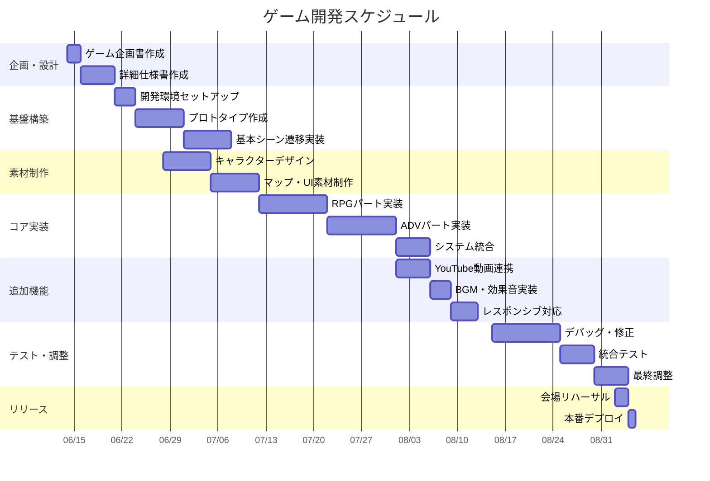

# 詳細設計

## 1. プロジェクト概要

### 1.1 目的
結婚式の参加者に新郎の人生をRPG形式で追体験してもらうゲームを作成し、結婚式会場で遊んでもらう

### 1.2 ターゲット
- 結婚式参加者（老若男女）
- スマートフォン・タブレットでの操作を想定

### 1.3 技術スタック
- **フロントエンド**: Phaser.js + HTML5
- **開発環境**: Docker + （VSCode + cursol）
- **デプロイ**: **要検討（GitHub Pages想定）**

### 1.3 技術スタック
- **フロントエンド**: Phaser.js + HTML5
- **開発環境**: Docker + （VSCode + cursol）
- **デプロイ**: **要検討（GitHub Pages想定）**
- **素材制作**: 
  - **ドット絵**: Aseprite（キャラクター・アニメーション）
  - **画像加工**: GIMP（写真編集・背景・立ち絵）
  - **マップ制作**: Tiled（RPGマップ・レベルデザイン）
  - **UI設計**: Figma（メニュー・ボタン・レイアウト）
  - **AI支援**: **要検討（Stable Diffusion、Stable Diffusion Web UI、等でドット絵生成）**


### 1.4 プロジェクト制約
- **予算**: **0円想定**
- **納期**: **9月１日（結婚式の日程 9/5）**
- **開発期間**: **2.5ヶ月**
- **会場制約**: **要確認（Wi-Fi環境・デバイス）**

---

## 2. ゲーム仕様

### 2.1 ゲームフロー

QRコードスキャン → オープニング動画 →　ステージセレクト → RPGスタート → エンディング動画

- **要調整**: 各パートの詳細時間配分

### 2.2 ゲーム構成
1. **オープニング**: YouTube動画（スキップ可能） 約1.5分
2. **RPGパート**: 新郎の人生を追体験　ステージごとに５分
3. **エンディング**: 結婚への道のり + おめでとメッセージ　約1.5分

### 2.3 操作方法
- **移動**: タップ/クリック、十字キー
- **決定**: タップ/Enterキー
- **メニュー**: ESCキー/メニューボタン


## 3. シーン設計

### 3.1 シーン一覧

#### Scene 1: 幼少期（実家）
- **マップ**: **要確認（実家周辺の具体的な場所）**
- **イベント**: 
  - **要収集（家族との思い出話の具体的なエピソード）**
- **BGM**: **要選定（当時や思い出の音楽）**
  - ケツメイシ
  - 舐達麻
  - 各人すきなもの

#### Scene 2: 学生時代（小学校）
- **マップ**: **要確認（学校・部活動場所の特定）**
- **イベント**:
  - **要収集（部活動での成長エピソード）**
  - **要収集（友人との青春エピソード）**
  - **要収集（印象的で具体的なエピソード）**
- **BGM**: **要選定（当時や思い出の音楽）**
  - ケツメイシ
  - 舐達麻
  - 各人すきなもの

#### Scene 3: 学生時代（中学校）
  - **収集要（友人との青春エピソード）**
  - **収集要（印象的で具体的なエピソード）**
- **BGM**: **要選定（当時や思い出の音楽）**
  - ケツメイシ
  - 舐達麻
  - 各人すきなもの

#### Scene 4: 学生時代（高校）
**要収集（青春エピソード）**
  - ビデオカメラ落として、一部かけた
  - 竹田との派閥（竹田のチンピラをとか）
- **イベント**:
  - **要収集（新婦との出会いエピソード）**
  - **要収集（初デートの思い出）**
  - **要収集（プロポーズシーンの詳細）**
- **BGM**: **要選定（当時や思い出の音楽）**
  - ケツメイシ
  - 舐達麻
  - 各人すきなもの

#### Scene 5: 学生時代（大学）
- **マップ**: **要確認（式場・新居の場所）**
- **要収集（初デートの思い出）**  
- **イベント**:
  - **15万のBMWを乗り回して、すぐ壊れる**
- **BGM**: **要選定（当時や思い出の音楽）**
  - ケツメイシ
  - 舐達麻
  - 各人すきなもの

#### Scene 6: 社会人
- **マップ**: **要確認（式場・新居の場所）**   
- **イベント**:
  - **要収集（エピソード収集）** 
- **BGM**: **要選定（当時や思い出の音楽）**
  - ケツメイシ
  - 舐達麻
  - 各人すきなもの

### 3.2 バトルシステム保留（オプション）
- **人生の試練をバトルで表現**
- ポケモン風のターン制バトル
- 敵: 「受験のプレッシャー」「竹田の連中」「就活の不安」「仕事のストレス」等
- **要判断（実装可否は開発工数次第）**

---

## 4. キャラクター設計

### 4.1 主人公（新郎）
- **外見**: **要素材（新郎の写真提供待ち）**
- **年代別差分**: 幼少期、小、中、高、大学生、社会人、現在
- **表情**: 通常、笑顔、困った顔、決意の顔

### 4.2 サブキャラクター
- **新婦**: **要相談（デザイン・登場タイミング）**
- **家族**: **要作成（両親、兄弟姉妹の登場人物リスト）**
- **友人**: **要収集（各時代の重要な友人エピソード）**
    - だいち
    - こうたろう
    - かなと
    - おなき
    - その他高校
    - 小学生時の友達
    - 大学時代の友達
- **先生・上司**: **要確認（実名使用可否・成長に関わった人物）**

  →ぶっちゃけ、基本モブでよいはず

### 4.3 立ち絵仕様

- **実写絵あれば**
- **その他はイラスト屋でも持ってくる**
- **サイズ**: 200x400px
- **形式**: PNG（背景透過）
- **パターン**: 各主要キャラ最低3表情

---

## 5. UI/UX設計

### 5.1 画面レイアウト

#### RPGモード

OP画面


ステージセレクト画面


ゲームマップ画面


ADV画面


戦闘画面候補１（保留）


戦闘画面候補２（保留）


エンディング


### 5.2 メニュー画面
- **セーブ/ロード**: ローカルストレージ使用
- **設定**: 音量調整、画面モード
- **スキップ（保留）**: 既読部分の高速化

### 5.3 レスポンシブ対応
- **スマートフォン**: 横向き最適化
- **タブレット**: 横向き対応

---

## 6. 技術仕様

### 6.1 ファイル構成

```markdown
zosusoft-prj-hirokazu/
|   .eslintrc.js            # コード品質チェックツールの設定       
|   .gitignore              # Gitで管理しないファイルの指定
|   package-lock.json       # 依存関係の詳細バージョン固定
|   package.json            # プロジェクト情報・依存関係管理
|   tree_output.txt
|   webpack.config.js       # モジュールバンドラーの設定
|
+---.devcontainer           # Docker関連
|       devcontainer.json   # リモートコンテナの設定
|       docker-compose.yml  # 開発用のDocker Compose設定  
|       Dockerfile          # 開発用のDocker Compose構成   
|
+---Documents               # 各資料関係
|       detailds.md         # 詳細設計書
|       milestone.md        # 日程  
|       README.md           # つべこべ言わず、読んどけおらぁ
|
+---node_modules            # 開発ツール・リンター系のモジュール 
|
+---src                     # ソース
|   |   index.html          # メインHTMLファイル
|   |   index.js            # メインJavaScriptファイル
|   |
|   \---assets              # ゲーム素材
|       +---characters      # キャラクター関連
|       |   +---player      # プレイヤー
|       |   +---npcs        # NPC
|       |   +---enemies     # 敵キャラ
|       |
|       +---maps            # マップ・地形関連
|       |   +---tilesets    # タイルセット
|       |   |   +---objects # オブジェクト
|       |   |          xxxx.png     # 素材
|       |   +---previews    # プレビュー画像
|       |   |       xxx.png
|       |   \---test_maps   # テストマップ
|       |           xxx.tmj
|       |
|       +---ui              # UI素材
|       |   +---menus       # メニュー
|       |   +---buttons     # ボタン
|       |   \---icons       # アイコン
|       |
|       +---effects         # エフェクト
|       |   +---particles   # パーティクル
|       |   \---animations  # アニメーション
|       |
|       \---audio           # 音声素材
|           +---bgm         # BGM
|           +---se          # 効果音
|           \---voice       # ボイス
```

### 6.2 データ管理
```javascript
// セーブデータ構造例
const saveData = {
  playerName: "**要設定（新郎の名前）**",
  currentScene: "scene3",
  level: 25,
  experience: 1250,
  flags: {
    metWife: true,
    graduatedUniversity: true,
    gotJob: true
  },
  inventory: ["思い出の写真", "結婚指輪"],
  timestamp: "2025-06-16T10:30:00Z"
};
```

### 6.3 外部連携
- **YouTube API**: 動画再生・制御
- **Web Audio API**: BGM・効果音管理
- **Local Storage**: セーブデータ保存　（ブラウザを帰るとセーブデータは消える）

---

## 7. 素材仕様

### 7.1 画像素材
- **キャラクター**: 32x48px（ドット絵）
- **立ち絵**: 200x400px（PNG）
- **背景**: 800x600px（実写・イラスト）
- **タイル**: 32x32px（統一）

### 7.2 音声素材
- **BGM**: MP3、ループ対応
- **効果音**: 短い音（決定音、移動音等）
- **ボイス**: **要検討（重要シーンのみ、実装可否）**

### 7.3 動画素材
- **形式**: MP4（H.264）
- **解像度**: 1280x720p
- **長さ**: **要調整（オープニング3分、エンディング5分）**
- **配信**: **要設定（YouTube限定公開）**

---

## 8. 開発スケジュール
# ゲーム開発スケジュール

## ガントチャート



## 詳細フェーズ計画

### Phase 1: 企画・設計（1週間：6/14〜6/20）
- [x] ゲーム企画書作成（6/14-15）
- [ ] 詳細仕様書・UI設計完成（6/16-20）
- [ ] 技術スタック確定
- [ ] アセット要件定義

### Phase 2: 基盤構築（2週間：6/21〜7/4）
**Week 1（6/21-27）：環境構築**
- [ ] 開発環境セットアップ
- [ ] Phaserプロジェクト初期化
- [ ] Git/デプロイ環境構築

**Week 2（6/28-7/4）：プロトタイプ**
- [ ] 基本シーン遷移実装
- [ ] キャラクター移動システム
- [ ] セーブ・ロード機能

### Phase 3: 素材制作（2週間：6/28〜7/11）
**Week 1（6/28-7/4）：キャラクター**
- [ ] **要収集**：写真・個人情報収集
- [ ] キャラクターデザイン・立ち絵作成
- [ ] 表情差分作成

**Week 2（7/5-11）：環境・UI**
- [ ] **要制作**：マップ用Tiledアセット
- [ ] **要制作**：UI用Figmaデザイン
- [ ] BGM・効果音選定

### Phase 4: コア機能実装（3週間：7/12〜8/1）
**Week 1（7/12-18）：RPGパート**
- [ ] マップ表示・移動システム
- [ ] **要判断**：バトルシステム実装可否
- [ ] インベントリ・ステータス

**Week 2（7/19-25）：ADVパート**
- [ ] 会話システム実装
- [ ] シナリオ分岐処理
- [ ] 演出効果実装

**Week 3（7/26-8/1）：統合**
- [ ] RPG⇔ADV切り替え
- [ ] セーブデータ統合
- [ ] システム最適化

### Phase 5: 追加機能（2週間：8/1〜8/14）
**Week 1（8/1-7）：メディア統合**
- [ ] **要実装**：YouTube動画連携
- [ ] **要実装**：BGM・効果音統合
- [ ] 動画再生UI実装

**Week 2（8/8-14）：品質向上**
- [ ] レスポンシブ対応
- [ ] アニメーション追加
- [ ] パフォーマンス最適化

### Phase 6: テスト・調整（3週間：8/15〜9/4）
**Week 1（8/15-21）：デバッグ**
- [ ] 機能別単体テスト
- [ ] バグ修正・調整
- [ ] クロスブラウザテスト

**Week 2（8/22-28）：統合テスト**
- [ ] シナリオ通しテスト
- [ ] 各デバイスでの動作確認
- [ ] ユーザビリティテスト

**Week 3（8/29-9/4）：最終調整**
- [ ] **要調整**：結婚式会場でのリハーサル
- [ ] 最終バグ修正
- [ ] パフォーマンスチューニング

### Phase 7: リリース（3日間：9/2〜9/5）
- [ ] 会場での動作確認（9/2-3）
- [ ] 最終デプロイ（9/4）
- [ ] 本番運用開始（9/5）

## リスク管理

### 高リスク項目
1. **YouTube API連携**：技術的難易度高
2. **会場でのネットワーク環境**：事前確認必須
3. **デバイス互換性**：多機種での動作保証

### 対策
- YouTube連携はオプション機能として実装
- オフライン動作も考慮した設計
- 主要デバイスでの早期テスト実施

## マイルストーン
- **7/4**：プロトタイプ完成
- **8/1**：コア機能完成
- **8/28**：ベータ版完成
- **9/5**：本番リリース


## 9. リスク管理

### 9.1 技術的リスク
- **パフォーマンス**: 素材サイズの最適化
- **ブラウザ対応**: クロスブラウザテスト必須
- **ネットワーク**: **要検討（オフライン機能の必要性）**

### 9.2 運用リスク
- **会場のWi-Fi**: **要確認（事前テスト必須）**
- **デバイス対応**: 様々な端末での動作確認
- **バックアップ**: **要準備（複数の配信経路）**

### 9.3 コンテンツリスク
- **著作権**: **要確認（BGMは著作権フリー素材使用）**
- **プライバシー**: **要確認（個人情報の取り扱い注意）**

---

## 10. 成功指標

### 10.1 定量指標
- ゲーム完了率: **要設定（80%以上が目標）**
- 平均プレイ時間: **要調整（15-20分が目標）**
- 同時接続数: **要テスト（50人対応が目標）**

### 10.2 定性指標
- 参加者の満足度
- SNS でのシェア数
- 新郎新婦の満足度

---

## 11. 付録

### 11.1 参考資料
- Phaser.js公式ドキュメント
- Tiled マップエディタ使用法
- YouTube API リファレンス

### 11.2 素材リソース
- **要収集（無料ドット絵素材サイトのリスト）**
- **要収集（著作権フリーBGMのリスト）**
- **要収集（結婚式向けテンプレートのリスト）**

### 11.3 連絡先
- **要設定（開発チーム連絡先）**
- **要作成（緊急時対応手順）**
