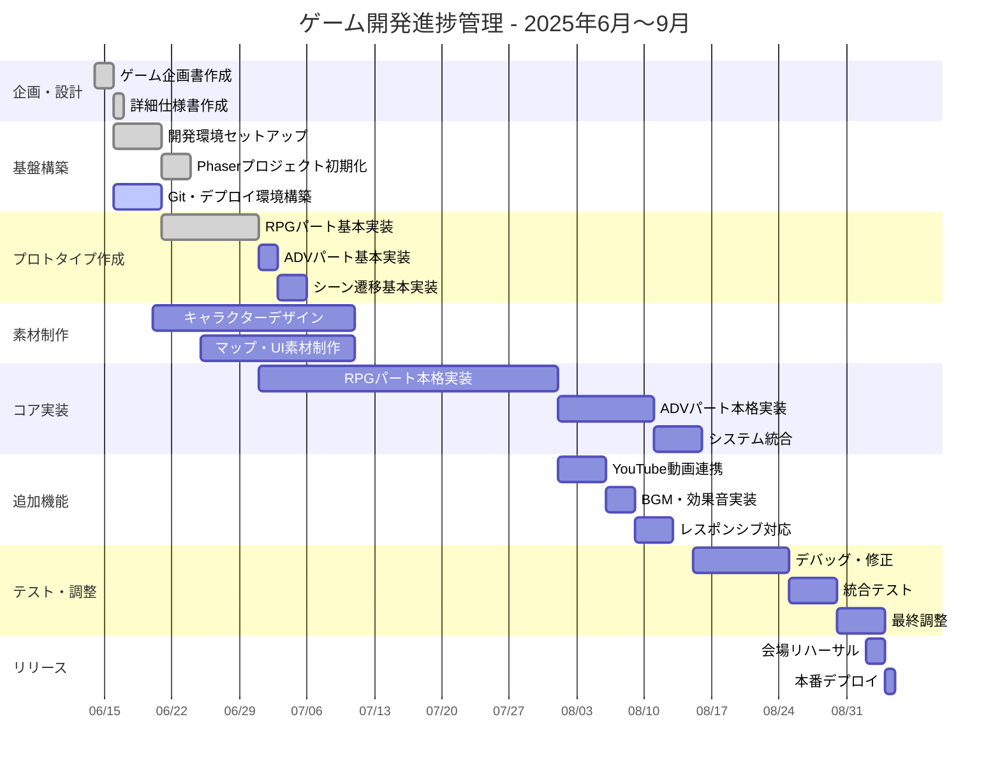

## ガントチャート

```mermaid
gantt
    title ゲーム開発進捗管理 - 2025年6月〜9月
    dateFormat YYYY-MM-DD
    axisFormat %m/%d
    
    section 企画・設計
    ゲーム企画書作成     :done, planning1, 2025-06-14, 2d
    詳細仕様書作成       :done, planning2, after planning1, 1d
    
    section 基盤構築
    開発環境セットアップ :done, dev1, 2025-06-16, 5d
    Phaserプロジェクト初期化 :done, dev2, after dev1, 3d
    Git・デプロイ環境構築 :active, dev3, 2025-06-16, 5d
    
    section プロトタイプ作成
    RPGパート基本実装   :done, proto1, 2025-06-21, 10d
    ADVパート基本実装   :proto2, 2025-07-01, 2d
    シーン遷移基本実装   :proto3, after proto2, 3d
    
    section 素材制作
    キャラクターデザイン :asset1, 2025-06-20, 21d
    マップ・UI素材制作  :asset2, 2025-06-25, 16d
    
    section コア実装
    RPGパート本格実装   :core1, 2025-07-01, 31d
    ADVパート本格実装   :core2, after core1, 10d
    システム統合        :core3, after core2, 5d
    
    section 追加機能
    YouTube動画連携     :extra1, 2025-08-01, 5d
    BGM・効果音実装     :extra2, after extra1, 3d
    レスポンシブ対応     :extra3, after extra2, 4d
    
    section テスト・調整
    デバッグ・修正       :test1, 2025-08-15, 10d
    統合テスト          :test2, after test1, 5d
    最終調整            :test3, after test2, 5d
    
    section リリース
    会場リハーサル       :release1, 2025-09-02, 2d
    本番デプロイ        :release2, after release1, 1d
```
## 詳細フェーズ計画

📊 **進捗管理**: [Issue #1で管理中](https://github.com/zos-shoyusoft-proj-hirokazu/hirokazu-life-journey/issues/1)
